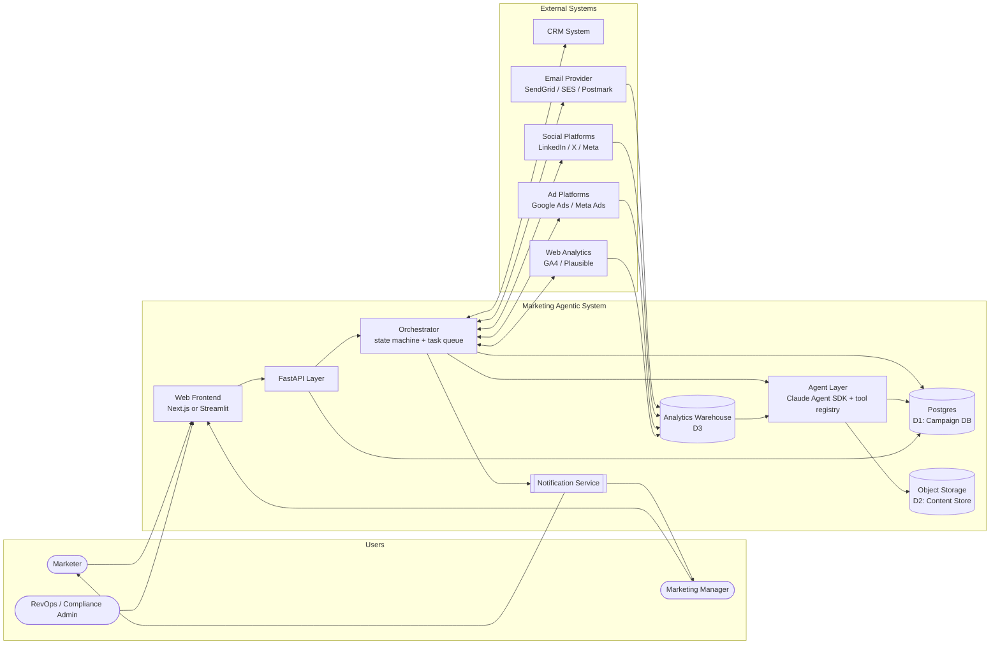
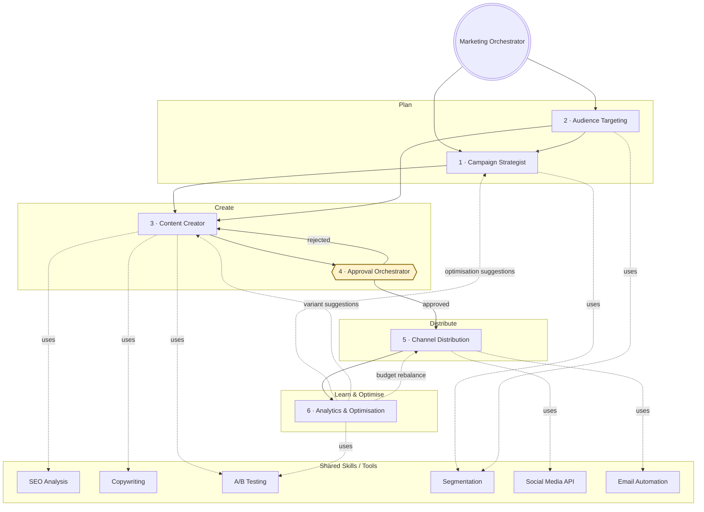
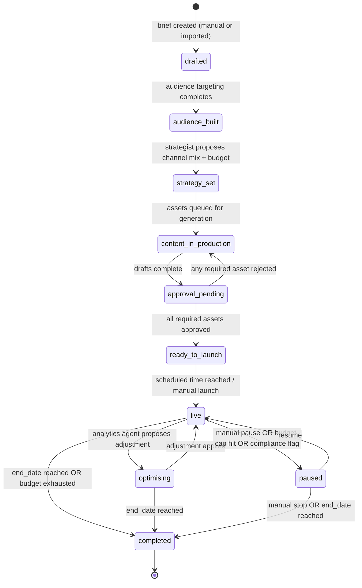
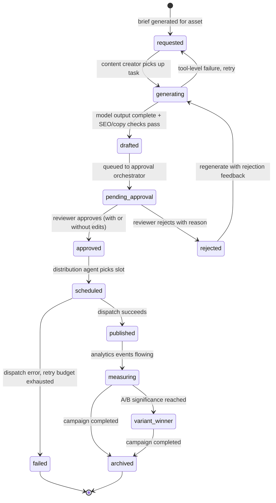

# MAS — Agent Architecture

Four diagrams. Read them in order.

1. **System context** — where MAS sits between users, external systems, and its own internals.
2. **Agent map** — the orchestrator plus the five specialist agents from `MAS.png`, with the shared skills/tools layer and the approval gate explicit.
3. **Campaign lifecycle state machine** — how a campaign moves through its states.
4. **Content asset lifecycle state machine** — how a content asset moves from brief to publish.

All diagrams are Mermaid. They render natively in GitHub / GitLab / most IDEs and any Markdown tool with Mermaid support.

---

## 1. System context

MAS is a Python backend with a FastAPI surface, a Claude-Agent-SDK-based agent layer, and integrations into CRM, social platforms, ad platforms, and email providers. Users are marketers, marketing managers, and admins. The orchestrator is the traffic controller — nothing calls a specialist agent directly from a browser click; every action flows through the orchestrator's task queue.

---

## 2. Agent map

One orchestrator, five specialist agents, six shared tools, one approval gate. The orchestrator holds the state machine; every arrow into an agent is a scheduled task, every arrow out is an event. The approval gate (`Approval Orchestrator`) is a hard barrier — outbound publishes (content, dispatch) cannot bypass it in MVP.

**Reading this diagram:**
- Solid arrows are first-class orchestrated transitions.
- Dashed arrows are advisory — they influence later runs but don't directly drive execution.
- Dotted `uses` arrows are tool invocations available to that agent through the SDK tool registry.
- The Approval Orchestrator is a hard gate for any outbound action in MVP. Phase 2 may introduce auto-approval thresholds for known-safe variant tweaks (see `P2-optimisation.md`).

---

## 3. Campaign lifecycle state machine

From brief to closure. Transitions with `[guard]` conditions only fire when the guard passes — otherwise the campaign stays put.

**Key transitions to note:**
- `approval_pending -> content_in_production` on rejection: a single rejected required asset blocks launch and bounces the campaign back to the Content Creator. Optional assets do not block.
- `live <-> optimising`: optimisation is mid-flight, not a separate phase. The campaign re-enters `live` once the change is applied; budget/creative deltas are journaled.
- `live -> paused` on `compliance flag`: triggered by the Audit cross-cutting check (see E15) when an unsubscribe rate or content-policy threshold is crossed.

---

## 4. Content asset lifecycle state machine

Content assets live within a campaign but progress independently. Each asset (email, social post, ad creative, blog) has its own lifecycle; the campaign waits on the slowest required asset.

**Key transitions to note:**
- `rejected -> generating`: the rejection reason is fed back to the Content Creator agent as additional context for the regenerate prompt; assets do not silently re-enter the queue.
- `scheduled -> failed`: a dispatch failure only ends the asset's lifecycle after the retry budget is exhausted. Each retry is journaled in `agent_logs`.
- `measuring -> variant_winner`: applies only to assets in an active A/B test (see E09); non-variant assets go straight from `measuring` to `archived` on campaign completion.

---

## Cross-cutting concerns

These are not in the agent map because they wrap every agent, not slot between them.

- **Audit (E15)** — every state change, every model call, every external API call writes to `agent_logs` (per-task) or `analytic_events` (per-outcome). Append-only; no UPDATE/DELETE rights for the app role.
- **RBAC (E14)** — every API call carries `tenant_id` and `user_id`; every domain table is scoped by `tenant_id`. The orchestrator refuses to schedule a task that crosses tenant boundaries.
- **Compliance (E16)** — unsubscribe links, suppression lists, GDPR data-subject requests, CAN-SPAM identity blocks, retention policies. The Channel Distribution agent consults the suppression list before every send.
- **Observability (E16)** — OpenTelemetry traces span the orchestrator, agent calls, tool calls, and external API calls. The campaign-id and task-id are propagated as span attributes.
